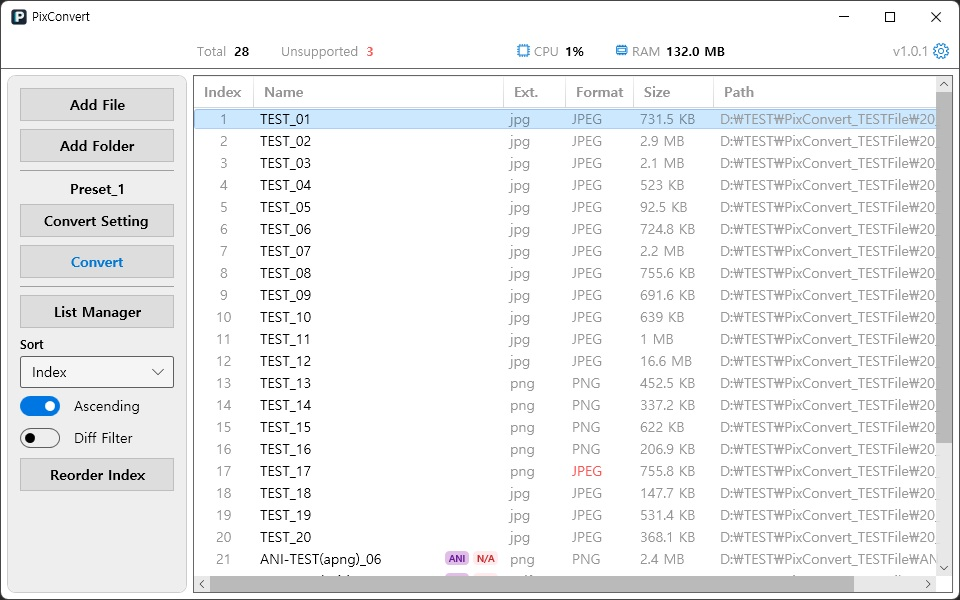
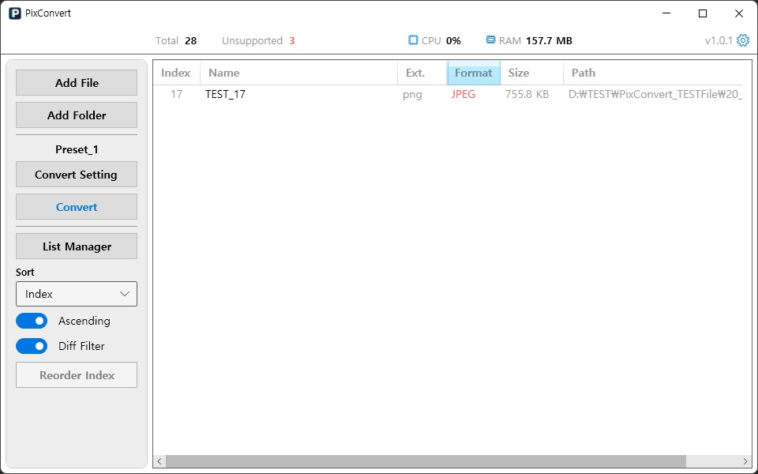
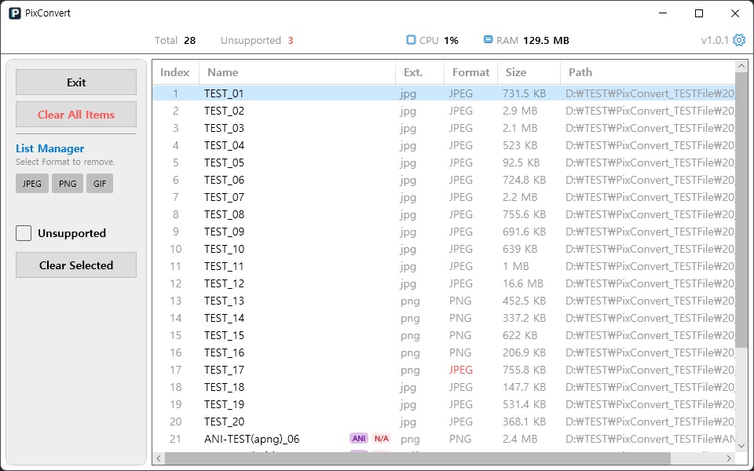
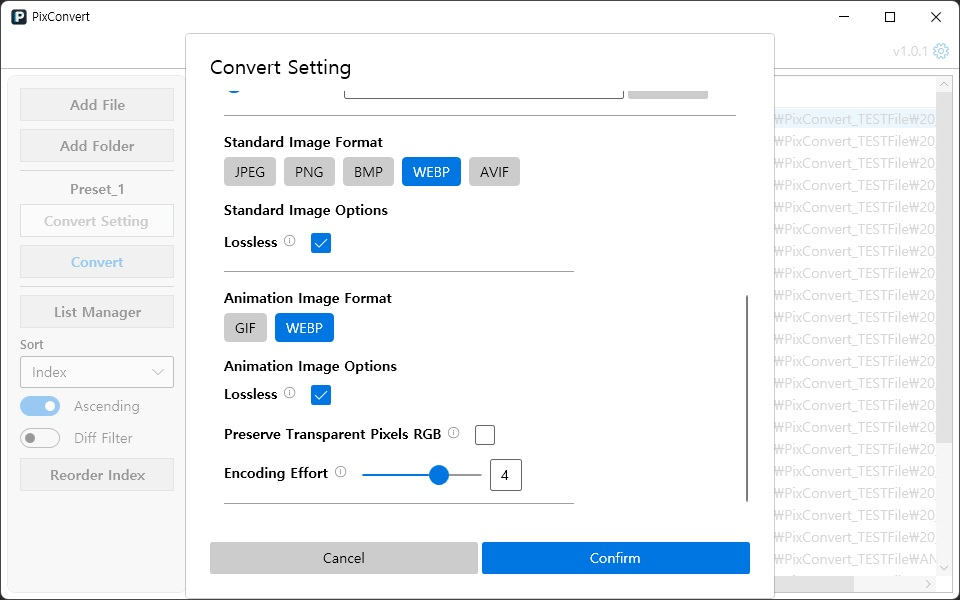
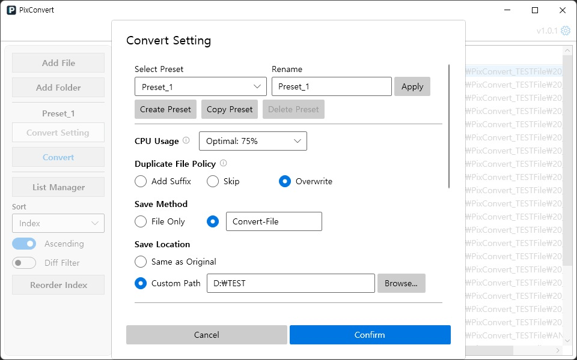
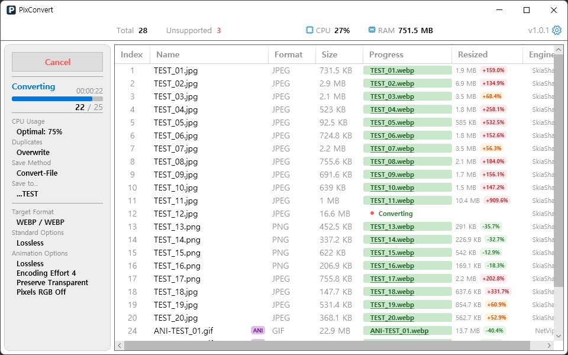

이 포스트는 Windows용 이미지 변환기 `PixConvert`를 개발하면서 진행했던 기획, 구조 설계, 변환 엔진 구현, 성능 최적화, 릴리즈 패키징 과정을 정리한 개발 일지입니다. 처음에는 가볍게 사용할 수 있는 이미지 확장자 변환 프로그램을 목표로 시작했지만, 개발 과정에서 파일 분석, 대량 처리, 병렬 변환, 프리셋, 다국어, 로그, 테스트, 배포 구조까지 확장하게 되었습니다.

<!-- end -->

# 개요

- 프로젝트 이름
  - PixConvert
- 프로젝트 목표
  - 직관적이고 가볍게 사용할 수 있는 Windows용 이미지 확장자 변환기 개발
  - 대량 파일을 안정적으로 처리하고, 정지 이미지와 애니메이션 이미지를 한 목록에서 변환
- 기술 구성
  - Language: `C#`
  - Framework: `.NET 10.0`, `WPF`
  - UI: `ModernWPF`
  - MVVM: `CommunityToolkit.Mvvm`
  - Image Engine: `SkiaSharp`, `NetVips`
  - Logging: `Serilog`
  - Test: `xUnit`, `Moq`
- 개발 환경
  - OS: Windows 11
  - Editor: VS Code, Visual Studio
  - AI Tools: Gemini, Codex, Claude
- 개발 기간
  - 개발 시작: 2026-02
  - v1.0.0 / v1.0.1 릴리즈 정리: 2026-04-25
  - 문서 및 GitHub 설정 정리: 2026-04-26

---

# 프로젝트를 시작한 이유

이미지 포맷을 변환할 수 있는 프로그램은 이미 많지만, 제가 원하는 방식은 조금 달랐습니다.

단순히 파일 하나의 옵션을 세세히 조정하며 변환하는 도구보다는 여러 파일과 폴더를 한 번에 추가해서 원본과 비슷한 품질로 빠르게 변환할 수 있는 기능이 필요했습니다.

처음 기획 단계에서는 `PNG`, `JPG/JPEG`, `BMP`, `GIF`, `WebP` 정도의 일반적인 포맷 변환을 목표로 잡았습니다.
이후 개발을 진행하면서 `AVIF`, 애니메이션 `GIF`, 애니메이션 `WebP`까지 범위를 넓혔고, 반대로 라이브러리 제약이 명확한 부분은 과감하게 제외하는 방향으로 정리했습니다.

PixConvert는 이전 프로젝트인 TagNamer에서 사용했던 일부 구조를 기반으로 시작했습니다.
파일 목록, 정렬, 다국어, Snackbar 같은 기초 구조를 재사용하면서도 이미지 변환이라는 도메인에 맞게 대부분의 구조를 다시 설계했습니다.

# 초기 기획

초기 기획에서 가장 중요하게 본 부분은 다음과 같습니다.

- 파일 또는 폴더 단위로 다수의 이미지를 추가할 수 있어야 함
- 대량 파일을 넣어도 조작이 원활해야 함
- 실제 파일 포맷을 기준으로 변환해야 함
- 범용성이 높은 포맷 위주로 지원해야 함
- 변환 결과가 원본과 최대한 유사해야 함.
- 다수의 이미지를 조작하기 때문에 파일 추가/분석/변환의 속도가 빨라야 함.
- 위 두 가지를 충족하면서 파일 크기를 줄여야 함.

처음에는 기능 목록만 보면 단순한 변환 프로그램처럼 보였지만, 실제로는 파일 I/O, 이미지 디코딩/인코딩, UI 가상화, 비동기 처리, 경로 충돌 처리, 다국어 리소스, 배포 라이선스까지 고려해야 하는 프로젝트였습니다.

# 전체 개발 흐름

개발 과정은 크게 다섯 단계로 나눌 수 있습니다.

| 단계  | 주요 내용                                                   |
| ----- | ----------------------------------------------------------- |
| 1단계 | 기존 구조 정리, MVVM 분리, 다국어, 파일 목록 기반 구현      |
| 2단계 | 파일 시그니처 분석, 대량 파일 로딩 최적화, 정렬/필터링 구현 |
| 3단계 | 프리셋, 변환 설정, SkiaSharp/NetVips 기반 변환 엔진 구현    |
| 4단계 | 병렬 변환, 취소 처리, 경로 충돌 방지, BMP/AVIF 안정화       |
| 5단계 | UI 정리, 테스트 보강, 릴리즈 패키징, README/라이선스 정리   |

## 파일 입력과 분석 구조

PixConvert에서 파일 목록은 단순히 경로 문자열을 보여주는 영역이 아닙니다.

이미지 변환에서 중요한 것은 파일 확장자가 아니라 실제 파일 내용입니다. 예를 들어 사용자가 `webp` 파일의 확장자를 `.jpg`로 바꾸면, 확장자만 보는 방식으로는 잘못된 변환 경로를 선택할 수 있습니다.

그래서 파일 추가 단계에서 매직 넘버 기반의 파일 시그니처 분석을 도입했습니다.

### 파일 시그니처 분석

파일의 시작 바이트를 읽어 실제 포맷을 판별하고, 확장자와 실제 포맷이 다르면 목록에서 불일치 상태를 표시하도록 했습니다.

이를 통해 사용자는 변환 전에 다음과 같은 정보를 확인할 수 있습니다.

- 파일명
- 확장자
- 실제 포맷
- 확장자와 실제 포맷의 불일치 여부
- 애니메이션 이미지 여부
- 지원 가능 여부

이 기능은 단순한 편의 기능이라기보다 변환 안정성을 높이기 위한 사전 검수 단계였습니다.

#### 불일치 필터

사이드바의 정렬 기능에 `Diff Filter` 토글 버튼을 추가하여, 확장자와 실제 포맷이 다른 파일들을 따로 볼 수 있는 기능을 제공했습니다.

앱 동작에 큰 변화가 생기는 사항이 아니기 때문에, 과한 알림이나 표현을 사용하는 것보다는,
사용자가 원한다면 인지를 쉽게 할 수 있는 추가 기능을 제공하는 것이 더 나은 사용자 경험이라고 판단했습니다.

#### 목록 관리 기능

대량 파일을 추가한 뒤에는 변환 대상에서 제외할 파일을 빠르게 정리할 수 있어야 했습니다.
그래서 `List Manager` 모드를 추가했습니다.

해당 모드에서는 목록 전체 삭제 기능과 지원 포맷 태그를 통한 그룹 제거, 미지원 파일 일괄 제거 기능을 제공합니다.

### 대량 파일 로딩 최적화

초기에는 1만 개 수준의 파일을 추가하면 로딩 시간이 약 3분 정도 소모되었습니다.

원인은 여러 가지였습니다.

- 파일마다 반복되는 디스크 접근
- `FileInfo` 기반 메타데이터 조회 중복
- 확장자 중복 검사에서 발생하는 비효율
- Shell API 기반 아이콘 추출 비용
- 순차 I/O 처리 구조

먼저 아이콘 추출 기능을 제거하고, 중복 검사를 `HashSet` 기반으로 바꾸면서 시간을 줄였습니다.
이후에는 파일 메타데이터와 시그니처를 한 번의 스트림 접근에서 처리하는 구조로 바꾸었고, 마지막으로 `Parallel.ForEachAsync`를 적용해 I/O 병렬 처리를 도입했습니다.

그 결과 NVMe SSD 환경에서 1만 개의 콜드 캐시 파일 기준, 로딩 시간을 대략 15초까지 줄였습니다.

> 단일 디스크뿐만 아니라, 여러 디스크에서 동시에 파일을 추가할 때도 디스크별로 병렬도를 조절하여 안정성을 높이고 사용자의 조작과 유사하게 파일이 추가되도록 했습니다.

## 변환 엔진 설계

앱 개발 의도에 가장 적합한 엔진은 `SkiaSharp`였습니다.
그래서 처음 기획에서는 `SkiaSharp` 단일 엔진을 사용하는 구조로 기획했지만,
WebP 포맷은 정지 이미지와 애니메이션 이미지를 모두 지원하는데, `SkiaSharp`로는 정지 이미지인 WebP만 처리 가능하다는 문제가 있었습니다.

그렇다고 정지 이미지만 지원하기에는 지원 포맷 개수가 너무 적어지는 문제도 발생했고,
애니메이션 이미지 처리와 최신 포맷인 `AVIF`까지 지원 가능한 `NetVips`를 함께 사용하는 방향으로 정리했습니다.

많이 사용되는 `JPEG`, `PNG`, `BMP`, `WebP` 정지 이미지들은 `SkiaSharp`를 사용하여 빠르게 변환하고,

CPU를 많이 사용하여 압축률을 올리는 최신 포맷인 `AVIF`나 애니메이션 이미지인 `GIF`, `WebP`는 `NetVips`에서 담당하도록 설계했습니다.

### BMP 변환 문제

개발 중 가장 예상 밖이었던 부분은 BMP였습니다.

BMP는 많이 사용되는 포맷이라서 당연히 엔진을 통해서 지원할 수 있다고 생각했지만, `SkiaSharp`의 일반 인코딩 경로에서는 BMP 저장이 바로 되지 않았습니다. `SKImage.Encode(BMP)`가 `null`을 반환하는 문제가 있었고, `NetVips`에서도 현재 구조에서는 BMP 출력을 안정적으로 맡기기 어려웠습니다.

결국 BMP는 직접 인코더를 작성하는 방식으로 해결했습니다.

구현한 BMP 인코더는 다음과 같은 처리를 합니다.

- 24-bit BMP 파일 헤더 작성
- 픽셀 데이터를 BGR 순서로 기록
- 4바이트 행 패딩 처리
- bottom-to-top 행 저장
- 투명 이미지의 경우 배경색으로 알파 합성 후 저장
- 행 단위 버퍼링으로 메모리 사용량 고정

처음에는 `GetPixel` 방식으로 접근했지만 성능이 좋지 않아, 이후 `GetPixelSpan()` 기반의 직접 바이트 접근으로 바꾸었습니다.

> `GetPixel` 방식은 픽셀마다 메서드를 호출해 색상 값을 가져오는 방식이라, `1920x1080` 이미지 기준 약 `2,073,600회`, `3840x2160` 이미지 기준 약 `8,294,400회`의 픽셀 접근 호출이 발생합니다. 반면 `GetPixelSpan()` 방식은 비트맵의 연속된 픽셀 메모리를 `ReadOnlySpan<byte>`로 직접 읽어, 같은 픽셀 수를 처리하더라도 픽셀별 메서드 호출과 `SKColor` 생성 비용을 피할 수 있습니다.

> PixConvert의 BMP 인코더는 원본을 `BGRA8888`로 맞춘 뒤, 각 픽셀에서 `B`, `G`, `R` 3바이트만 읽어 24-bit BMP로 기록합니다. 예를 들어 `1920x1080` 이미지는 출력 픽셀 데이터가 약 `6.22MB`, `3840x2160` 이미지는 약 `24.88MB`이며, 행 단위 버퍼 하나만 재사용하므로 이미지 전체를 별도 출력 버퍼로 복사하지 않습니다.

### AVIF 애니메이션 이미지 미지원

AVIF는 `AV1 Image File Format`의 약자로, AV1 코덱을 HEIF/ISOBMFF 계열 컨테이너에 담는 이미지 포맷입니다.

JPEG나 PNG보다 같은 화질 대비 파일 크기를 줄이기 유리하고, 알파 채널도 지원할 수 있어 웹 이미지 최적화나 고압축 이미지 저장에 많이 사용됩니다.
대신 인코딩 비용이 큰 편이고, 라이브러리별 지원 범위도 비교적 복잡합니다.

AVIF에는 정지 이미지뿐 아니라 `avis`라는 AV1 이미지 시퀀스를 사용하는 애니메이션 이미지도 존재합니다.

PixConvert에서는 `NetVips` 라이브러리로 AVIF 포맷을 지원하는데, 해당 라이브러리에서는 `avis` 이미지를 읽을 수는 있지만 저장 단계에서 애니메이션 이미지를 지원하지 않습니다.

1. 아직 사용 빈도가 높은 포맷이 아님
2. 비디오 코덱 기반이라 구현 복잡도가 크게 증가함
3. `avis` 하나만을 위해 다른 라이브러리를 추가로 사용해야 함

위와 같은 이유로 AVIF 포맷은 정지 이미지만 지원하는 것으로 결정했습니다.

## 프리셋과 변환 설정 관리

PixConvert는 다수의 파일을 일괄 변환하는 것이 특징인 프로그램입니다.
조작 횟수를 줄이면서 재사용성을 높이기 위해 프리셋 기능을 도입했습니다.

프리셋에는 다음과 같은 값이 포함됩니다.

- 출력 포맷 (정지/애니메이션 별도)
- CPU 사용량 제어
- 출력 방식/위치 정의
- 파일 충돌 처리 정책
- 공통 이미지 옵션
- 포맷별 이미지 옵션

초기에는 프리셋 로드 시점을 변환 옵션 창에 진입할 때로 설정했습니다.
하지만 테스트하는 과정에서, 이전 사용 시 설정했던 프리셋 옵션을 옵션 창에 들어가지 않고도 파일 추가만 한 뒤 바로 사용하는 케이스를 발견했습니다. 이를 해결하기 위해 앱 시작 시 `PresetService.InitializeAsync()`를 명시적으로 호출하고, `ActivePreset` 개념을 도입했습니다.

> 앱 시작 시 프리셋을 로드해서 `ActivePreset`으로 프로세스가 값을 보유하게 됩니다. 만약, 프리셋 파일 혹은 설정에 문제가 있다면 임의로 값을 조작하지 않고, 변환 시작 시 문제가 있다고 알려 사용자가 원하는 방식대로 해결 가능하도록 설계했습니다.

또한 프리셋 파일 로드에 실패할 경우 원본 데이터를 바로 덮어쓰지 않고 `.bak` 백업을 생성하도록 하여 이전 설정값을 사용자가 확인 가능하도록 설계했습니다.

## 병렬 처리 도입

이미지 변환은 파일 수가 많아지면 시간이 오래 걸리는 작업이기 때문에 병렬 처리를 도입했습니다.

### 드라이브 단위 병렬 처리

대량 파일 변환에서는 CPU보다 디스크 I/O가 병목이 되는 경우가 많았습니다.

특히 여러 드라이브에 흩어진 파일을 하나의 큐로 처리하면 특정 드라이브의 I/O 대기 때문에 전체 변환이 늦어질 수 있습니다. 이를 줄이기 위해 파일을 드라이브 단위로 그룹화하고, 드라이브별 병렬 큐를 나누는 구조를 도입했습니다.

> PixConvert는 파일 목록을 생성할 때 전체 경로를 한 번에 병렬 처리하지 않고, 먼저 `Path.GetPathRoot()` 기준으로 드라이브별 그룹을 나눕니다. 예를 들어 입력 순서가 `D:\a.png`, `C:\b.png`, `D:\c.png`, `E:\d.png`라면 처리 그룹은 `D: -> C: -> E:` 순서로 만들어지고, 같은 드라이브에 속한 파일만 해당 그룹 내부에서 `Parallel.ForEachAsync`로 병렬 분석됩니다.

> 각 드라이브의 병렬도는 `DriveInfoService`가 계산합니다. 고정 드라이브가 SSD로 판별되면 `Environment.ProcessorCount`만큼 병렬 처리하고, HDD로 판별되면 `4`로 제한합니다. 네트워크 드라이브는 `2`, 이동식 드라이브는 `4`, 판별 실패 시에는 `Math.Min(Environment.ProcessorCount, 8)`을 기본값으로 사용합니다.

이 구조는 단일 드라이브 환경에서는 큰 차이가 없지만, 다중 드라이브 환경에서는 작업 밀도를 더 안정적으로 분산할 수 있습니다.

### CPU 사용량 옵션

사용자가 변환 중 시스템 부하를 조절할 수 있도록 CPU 사용량 옵션을 만들었습니다.
이 옵션은 실제 CPU 점유율을 강제로 고정하는 기능이 아니라, 동시에 실행할 변환 작업 수(`MaxDegreeOfParallelism`)를 결정하는 기준입니다.

| 표시 옵션       | 내부 값   | 병렬 작업 수 계산                                                   |
| --------------- | --------- | ------------------------------------------------------------------- |
| 최대: 90%       | `Max`     | 논리 코어 수가 12 이하이면 `코어 수 - 1`, 12 초과이면 `코어 수 - 2` |
| 최적: 75%       | `Optimal` | `코어 수 * 3 / 4`                                                   |
| 절반: 50%       | `Half`    | `코어 수 / 2`                                                       |
| 낮음: 25%       | `Low`     | `코어 수 / 4`                                                       |
| 최소: 싱글 코어 | `Minimum` | `1`                                                                 |

예를 들어 논리 코어가 16개인 환경에서는 `Max`가 14개, `Optimal`이 12개, `Half`가 8개, `Low`가 4개, `Minimum`이 1개 작업으로 계산됩니다. 모든 계산 결과는 최소 1 이상이 되도록 보정했습니다.

해당 기능을 통해 `AVIF`처럼 CPU 점유율이 높은 포맷을 변환할 때 병렬도를 낮춰 다른 작업을 병행할지, 병렬도를 높여 변환을 빠르게 끝낼지 사용자가 정할 수 있도록 했습니다.

### 출력 경로 충돌 문제

병렬 변환을 구현하면서 유닛 테스트를 통해 출력 경로 충돌 문제를 확인했습니다.

예를 들어, 서로 다른 폴더에 존재하는 같은 이름의 파일을 하나의 출력 폴더로 변환하거나, Suffix 정책을 사용하는 상황에서는 여러 작업이 동시에 같은 파일명을 선택할 수 있습니다.

이를 해결하기 위해 변환 배치 단위의 메모리 예약 시스템인 `ConversionSession`을 도입했습니다.
각 변환 작업은 실제 파일을 쓰기 전에 출력 경로를 세션에 예약합니다.
이때 `HashSet`과 `lock`을 사용해 같은 세션 안에서 동일 경로가 동시에 선택되지 않도록 했습니다.

파일 충돌 정책은 다음과 같이 정리했습니다.

| 정책      | 동작                                                                        |
| --------- | --------------------------------------------------------------------------- |
| Suffix    | 사용 가능한 접미사 경로를 찾아 예약                                         |
| Skip      | 이미 존재하거나 예약된 경로라면 변환하지 않고 Skipped 처리                  |
| Overwrite | 첫 요청은 기본 경로를 사용하고, 같은 배치 내 중복 요청은 접미사 경로로 우회 |

또한 실제 변환이 발생하지 않은 항목을 `Success`로 표시하던 문제를 해결하기 위해 `Skipped` 상태를 추가했습니다.

이후 추가로 확인한 문제는 `Overwrite` 정책에서도 같은 배치 안의 병렬 작업끼리 동일한 출력 경로를 동시에 사용할 수 있다는 점이었습니다. 디스크에 이미 있는 파일을 덮어쓰는 것은 사용자가 선택한 동작이지만, 같은 변환 배치 안에서 서로 다른 입력 파일이 같은 출력 경로를 동시에 쓰는 것은 의도한 덮어쓰기가 아니라 병렬 쓰기 충돌에 가까웠습니다.

그래서 `Overwrite`도 세션 예약을 거치도록 변경했습니다. `ConversionSession.ReserveOverwrite()`는 첫 번째 요청에는 기본 출력 경로를 예약하고, 같은 세션에서 동일 경로가 다시 들어오면 `Suffix` 정책과 같은 방식으로 사용 가능한 접미사 경로를 찾아 예약합니다. 예를 들어 두 작업이 모두 `output\photo.jpg`를 만들려고 하면 첫 번째 작업은 `photo.jpg`, 두 번째 작업은 `photo_1.jpg`처럼 분리됩니다.

이렇게 해서 기존 파일을 덮어쓰는 사용자의 의도는 유지하면서도, 병렬 작업끼리 같은 파일을 동시에 쓰는 상황은 막을 수 있었습니다.

## 변환 중 UI 개선

초기 UI는 리스트의 종류가 하나였습니다.
변환 중일 때 필요한 정보를 사이드바에 출력하는 방식이었는데, 정보의 양이나 품질 면에서 미흡하다고 판단해서 변환 중 표시되는 전용 리스트를 개발했습니다.

변환 중 리스트에서는 다음 정보를 보여줍니다.

- 파일별 처리 상태와 완료 여부
- 변환 후 크기 및 원본과의 차이 비율
- 파일별 진행 상태 표기 (성공/실패/스킵/미지원 상태)

파일별 진행 상태 표기 항목이 **성공**일 때는 성공이라고 표기하지 않고, 실제 생성된 파일명을 출력하고,
해당 파일명을 클릭하면 파일 경로를 탐색기로 열 수 있도록 했습니다.

또한 변환 완료 후에는 즉시 초기 화면으로 돌아가지 않고, 사용자가 결과를 확인할 수 있는 상태를 유지하도록 설계했습니다.

## 테스트와 품질 관리

`xUnit` 기반 테스트 프로젝트를 만들고, 서비스와 뷰모델의 핵심 로직을 테스트했습니다. 현재 테스트 파일은 54개이고, `[Fact]`, `[Theory]` 기준의 테스트 케이스는 227개입니다.

테스트 범위는 다음과 같습니다.

- 파일 분석
- 정렬
- 출력 경로 결정
- 프리셋 검증
- 변환 세션
- 엔진 선택
- 변환 매트릭스
- Snackbar
- 다국어 리소스
- ViewModel 상태 전이
- 앱 메타데이터

특히 변환 엔진과 경로 충돌, 취소 같은 기능은 사용자 데이터에 직접 영향을 줄 수 있기 때문에 테스트를 두껍게 가져갔습니다.

## 릴리즈 패키징

최종 릴리즈는 Windows `win-x64` 기준 zip 배포를 목표로 정리했습니다.

배포 패키지에는 다음 파일이 포함됩니다.

- `PixConvert.exe`
- `libvips-42.dll`
- `LICENSE`
- `THIRD-PARTY-NOTICES.md`

`PixConvert.exe`는 self-contained single-file 방식으로 배포하되, `libvips-42.dll`은 외부 파일로 유지했습니다.

이렇게 한 이유는 `NetVips.Native.win-x64`가 `LGPL-3.0-or-later` 라이선스를 포함하기 때문입니다. 사용자가 필요하다면 해당 네이티브 라이브러리를 호환 가능한 다른 빌드로 교체할 수 있도록 실행 파일 내부에 완전히 묶지 않는 구조를 선택했습니다.

## 결과물

PixConvert의 최종 주요 기능은 다음과 같습니다.

- 최대 10,000개 이미지 파일 일괄 변환
- 정지 이미지와 애니메이션 이미지 혼합 처리
- 파일 시그니처 기반 실제 포맷 판별
- 확장자/시그니처 불일치 표시
- SkiaSharp + NetVips 기반 변환 엔진 라우팅
- JPEG, PNG, BMP, WebP, AVIF 정지 이미지 변환
- GIF, WebP 애니메이션 변환
- 프리셋 저장 및 활성 프리셋 표시
- CPU 사용량 기반 병렬도 제어
- 드라이브 단위 병렬 처리
- 변환 취소 및 취소 확인 다이얼로그
- 출력 파일 충돌 정책 지원
- 한국어/영어 다국어 지원

# 개발하면서 아쉬웠던 부분 및 개선 계획

## 핵심 기능 구현 시점

초반에 구조 정리에 많은 시간을 사용했고, 실제 변환 엔진은 중반 이후에 구현했습니다.

결과적으로 구조가 단단해진 장점은 있었지만, 프로젝트 리스크를 빨리 확인하려면 핵심 기능의 최소 동작 버전을 더 앞에 두는 편이 좋았을 것 같습니다.

## 메타데이터 처리

초기에는 EXIF 유지 옵션도 고려했지만, 최종 버전에서는 복잡도를 줄이기 위해 제거했습니다.

이미지 변환에서 메타데이터는 개인정보와도 연결될 수 있고, 포맷별 지원 방식도 다르기 때문에 단순히 "유지" 옵션 하나로 처리하기 어렵다고 판단했습니다. 추후 다시 넣는다면 포맷별 정책을 명확히 나누어야 할 것 같습니다.

## UI 자동 테스트

서비스와 뷰모델 테스트는 보강했지만, WPF UI 자체의 자동화 테스트가 미흡했습니다.

변환 상태 전환, 다이얼로그, 리스트 가상화 같은 부분은 거의 대부분 수동으로 검증했습니다.
어느 정도는 자동화 테스트를 사용했다면 하는 아쉬움이 남았습니다.

# 마무리

PixConvert는 처음에는 TagNamer 기반으로 UI를 재사용해 간단하게 이미지 변환 프로그램을 개발한다는 생각으로 시작했지만, 실제 개발 과정이 진행되면서 많은 기능을 탑재해야 했고, 그로 인해 UI도 대부분 변경하게 되었습니다.

이번 프로젝트를 하면서 핵심 기능을 더 빠른 시점에 개발하는 것이 좋겠다는 생각을 했습니다.
TagNamer의 잔재를 덜어내고 이미지 변환 프로그램에 맞게 UI/UX를 설계하고 변환 엔진을 탑재했는데,
변환 엔진의 옵션이나 방식 등으로 인해 재설계하게 된 UI/UX가 많았기 때문에 시간 낭비가 좀 있었기 때문입니다.

앞으로 PixConvert를 개선한다면 라이브러리 업데이트에 맞춰 현재 지원하는 기능의 안정성과 사용 흐름을 더 다듬는 방향으로 진행할 생각입니다.
